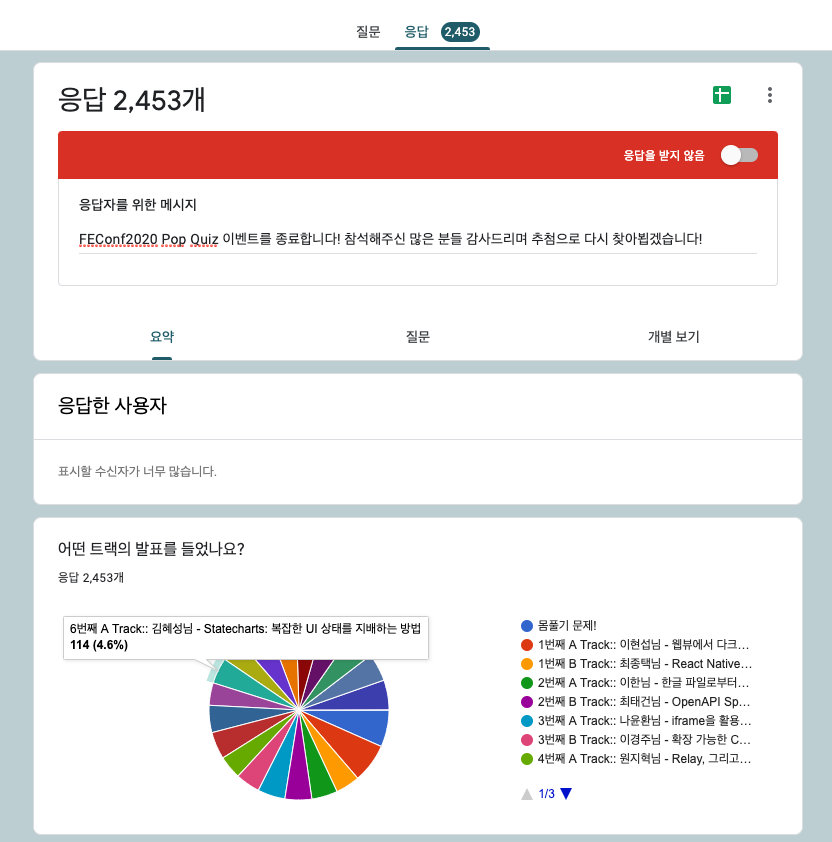
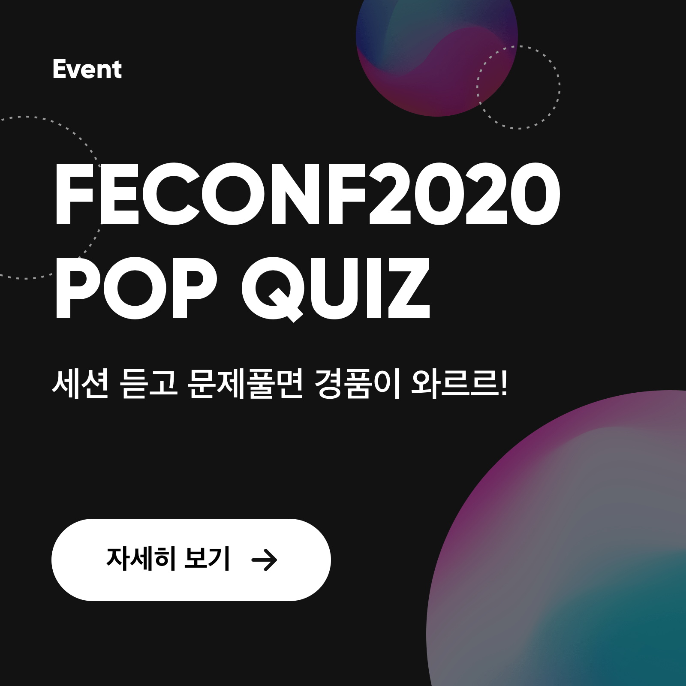
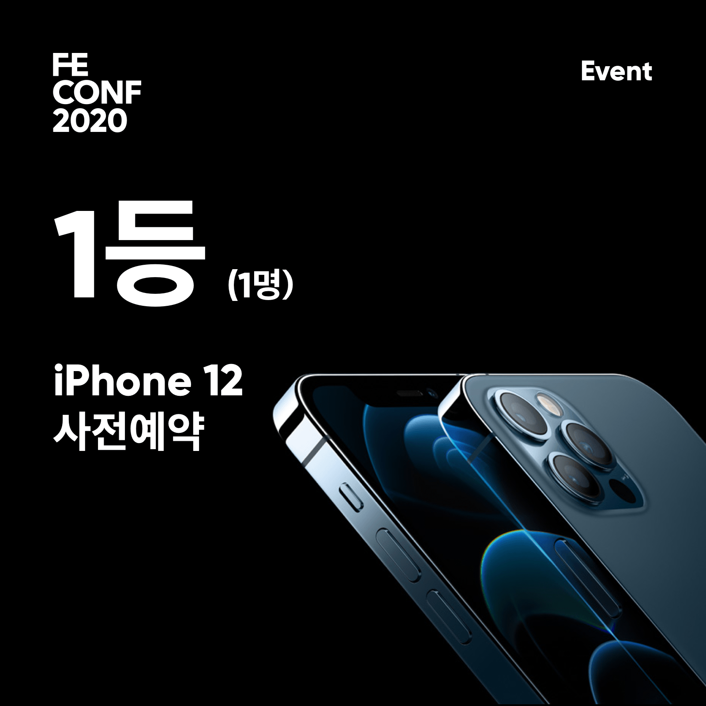
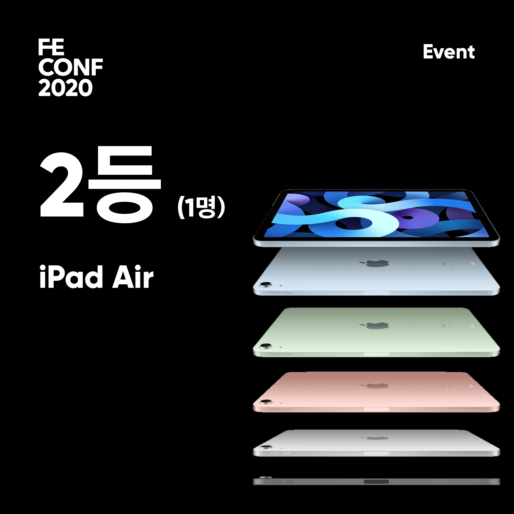
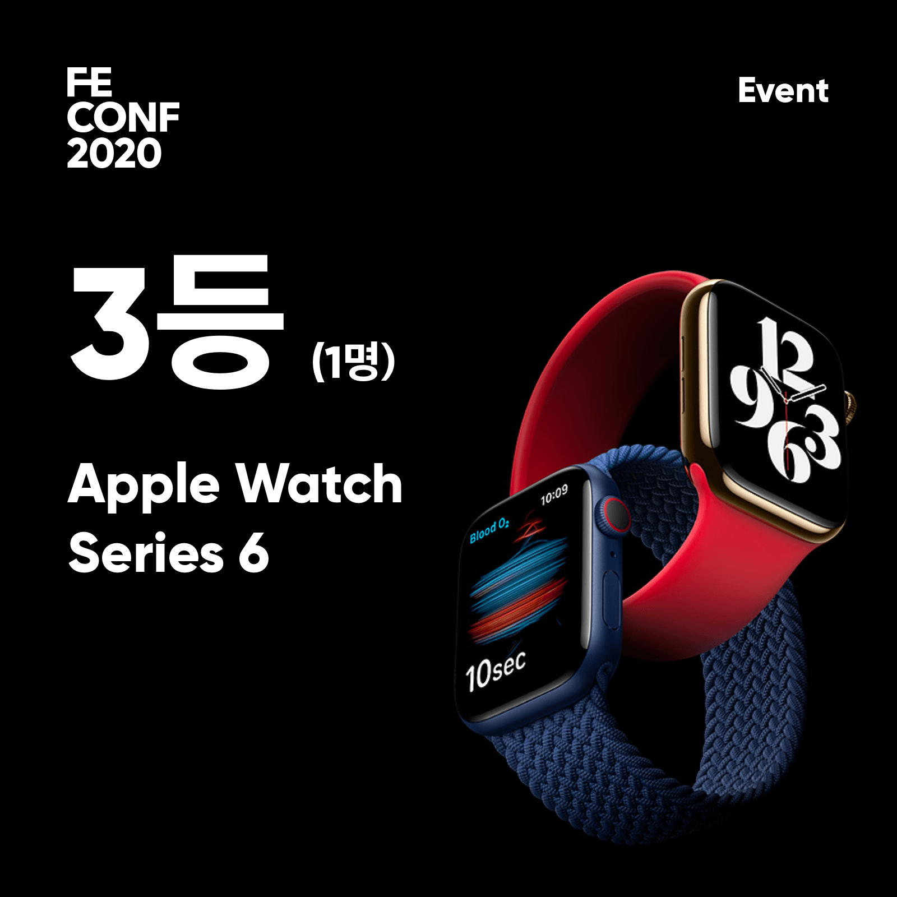
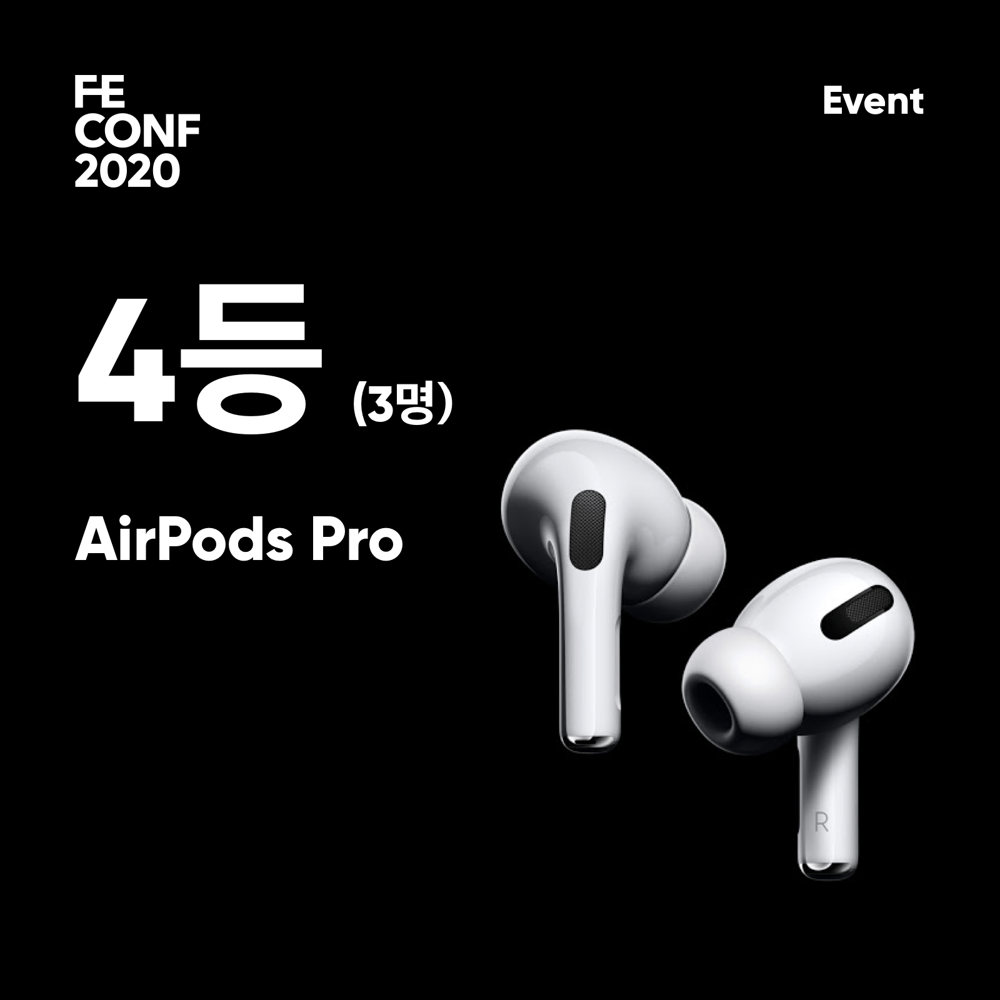
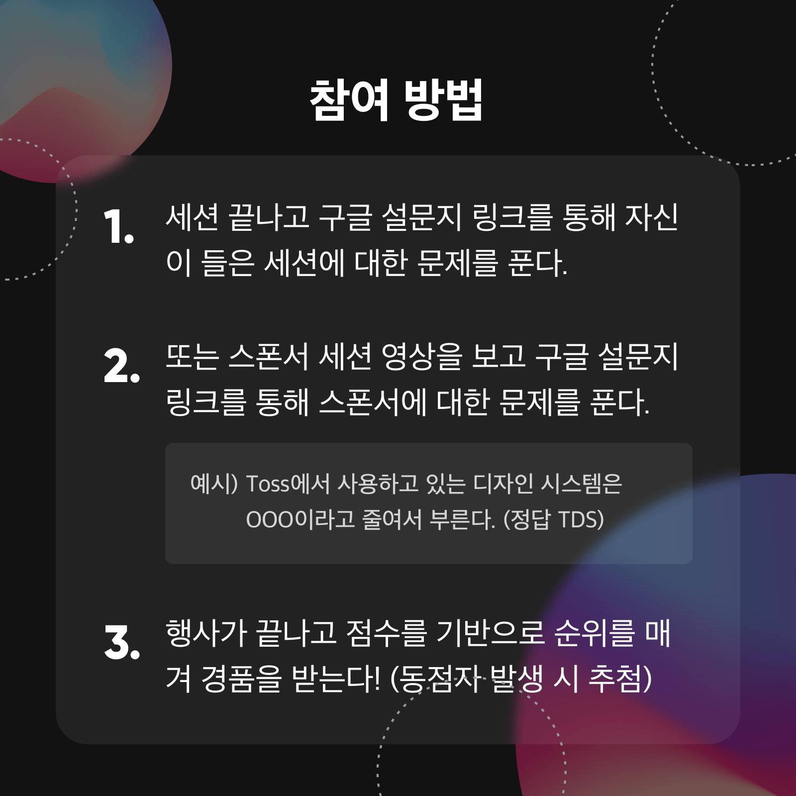

# FEConf2020 at Home Pop Quiz

이벤트 당첨 스크립트

- http://2020.feconf.kr/
- https://www.youtube.com/channel/UCWEzfYIpFBIG5jh6laXC6hA

## 결과



총 2,453개의 응답!

👉 [정답보러가기](./src/services/models/answer.ts)

## 점수 측정 방식

- 세션 문제 당 1점 (총 12점 만점)
- 보너스 문제 당 1점 (단, 보너스 문제는 만점 미만일 경우에만 적용)

> ex) 한 트랙에 대한 문제를 모두 맞히고 (6점) 보너스 문제를 전부 맞췄을 경우 (7점) => 13점이 되므로 **12점**으로 인정

## 추첨 방식

- 가장 높은 점수를 받은 사람 기준으로 경품을 순차 지급한다.
  - 점수 합산 최고점 -> 1등 상품
- 최고점이 다수일 경우, 추첨을 통해 당첨자를 선정한다.
  - 최고점이 50명일 경우, 50명에서 4등부터 1등까지 순차적으로 추첨을 진행한다. (중복 추첨은 제외)

## 실행

```sh
$ npm install
$ ntl
# database/*.csv 파일이 있어야 정상적으로 실행됩니다.
```

## 경품 이벤트

|||
|:-:|:-:|
|||
|||
|||

## Contact

feconf@googlegroups.com